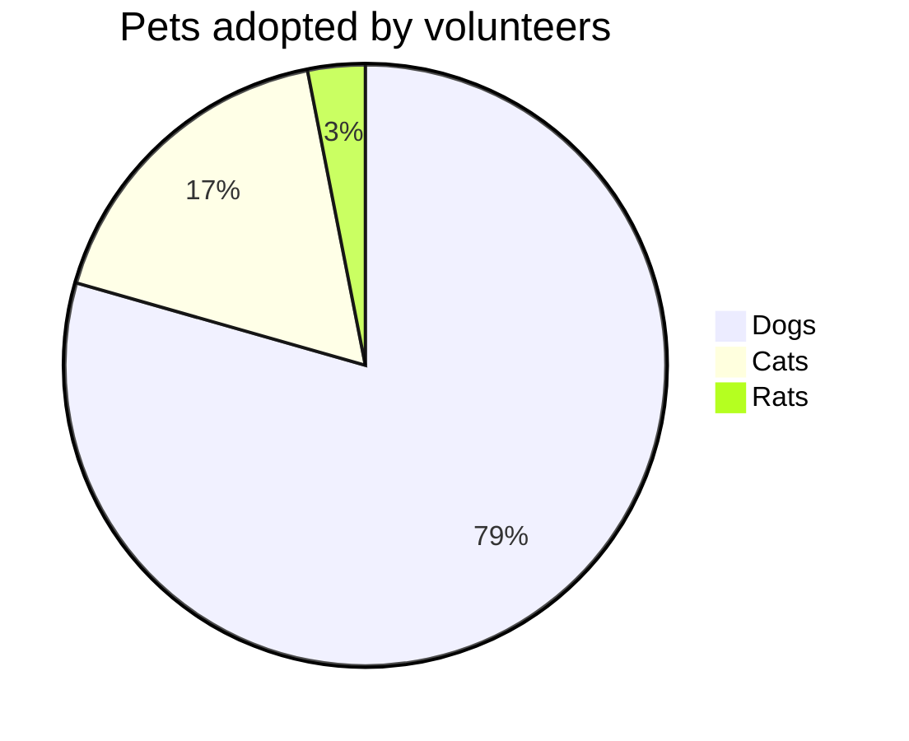

`📄 decorators.py`

<br/>

<br/>

A simple logger decorator.
<!-- NOTE-swimm-snippet: the lines below link your snippet to Swimm -->
### 📄 decorators.py
```python
1      def logger(function):
2          def wrapper(*args, **kwargs):
3              print(f"Function {function.__name__} was called")
4              result = function(*args, **kwargs)
5              print(f"Function {function.__name__} returned with {result}")
6              print("really cool")
7              return result
8          return wrapper
```

<br/>

<!--MERMAID {width:100}-->

<!--MCONTENT {content: "pie title Pets adopted by volunteers<br/>\n\"Dogs\" : 386<br/>\n\"Cats\" : 85<br/>\n\"Rats\" : 15<br/>"} --->

<br/>

This file was generated by Swimm. [Click here to view it in the app](https://app.swimm.io/repos/Z2l0aHViJTNBJTNBZGVjb3JhdG9ycy1zd2ltbSUzQSUzQXNvbGF0dGlsYQ==/docs/xnpi8).
